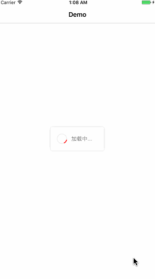

# NCLoadingView
仿招行信用卡客户端掌上生活app的加载Loading框

- [x] 最低支持iOS8
- [x] 使用swift3编写

## 录屏



# 功能
- [x] 加载框动画show和dismiss
- [x] 支持屏幕旋转后依然处于视图中心
- [x] 支持外观颜色定制
- [x] 单例运行模式，后面考虑增加实例运行模式


# 安装
目前只支持[cocospods](https://cocoapods.org)
```
pod 'NCLoadingView', '~> 0.1.0'
```


# 用法
###### 开始加载动画
```
NCLoadingView.show(in: self.view, with: "加载中...")
```
###### 关闭和退出

```
NCLoadingView.dismiss()
```


以上两个api是最基本的用法，当然具体的也支持带默认参数的方法，比如你可以直接


```
NCLoadingView.show()
NCLoadingView.dismiss()
```
也是可以的

当然你也可以定制属于你的颜色外观的加载框，只要show之前使用下面方法

```
NCLoadingView.textColor = UIColor.red //文本颜色
NCLoadingView.tintColor = UIColor.red //转圈颜色
```

# License
本项目使用MIT license
